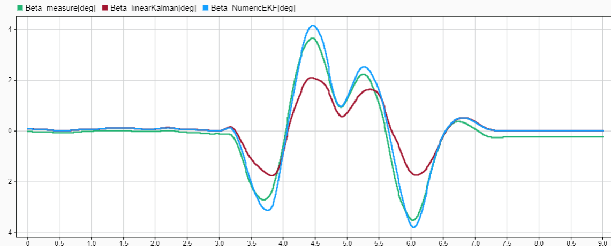

# Kalman-Filter
Header only kalman filter library

## Extended Kalman Filter
Provide two versions:
- Jacobian matrix externally calculated explicitly
- Jacobian matrix internally calculated numerically (suitable for complicated state transition or/and measurement functions)

### Example
For vehicle dynamics estimation, nonlinear tire model may be used for better results. However, some nonlinear tire models are way too complicated for the explicit jacobian matrix calculation,
for example the well-known Pacejka Magic Formula lateral tire force model:  
$F_y = D\cdot sin(C \cdot \arctan(B \cdot \alpha-E \cdot (B \cdot \alpha-\arctan(B \cdot \alpha))))$  
Thus we can calculate the jacobian matrix numerically at every step.  
The algorithm is validated by real vehicle test with 130km/h double lane change maneuver (estimated body side slip angle):  

